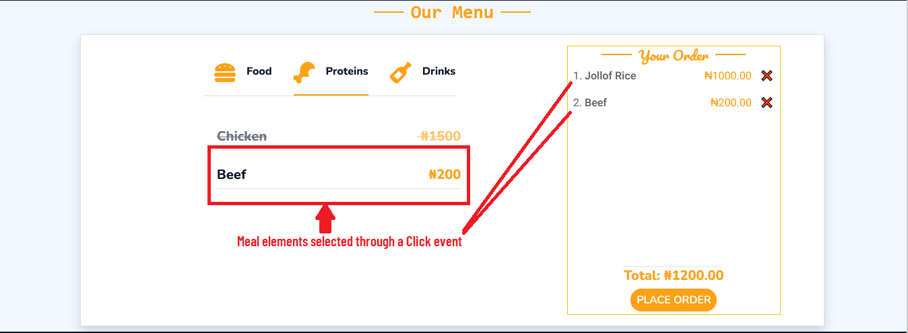
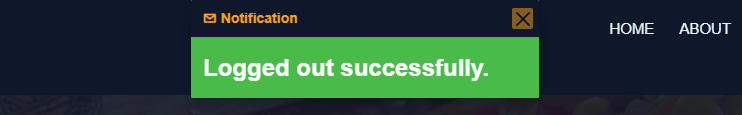

## Introduction

### Overview

The frontend of this application is built as a Multi-Page Application (MPA), providing a traditional, server-rendered experience with multiple distinct pages and navigation flows. This approach ensures that each page is independently loaded and rendered.

### Technology Stack

The frontend technologies used in this application are:

- HTML5
- CSS
- Bootstrap
- JavaScript
- JQuery

### User Interface and Experience (UI/UX)

While MPAs often result in more page refreshes, we focus on providing a smooth, intuitive navigation experience with clear calls to action and content organization.
Each page is designed with accessibility and user-centric design principles to ensure that all users, regardless of device or ability, can interact with the application effectively.
The entire application is fully responsive and adjusts to different screen sizes. From the navigation menu to the responsive tables, users with
different screen sizes can access and enjoy the experience while on the application.

## Architecture

### Frontend Structure

#### Folder Structure

The entire application folder is structured in this format:

```
└── 📁accounts
└── 📁canteen
└── 📁main
└── 📁static
└── 📁templates
```

:::info
By default, Django stores Html files in the templates directory.
:::

#### Templates

The _templates_ folder is sub-divided into folders containing Html files.

```
└── 📁templates
    └── 📁account
        └── add_user_to_group.html
        └── change_password.html
        └── login.html
        └── search_popup.html
        └── search.html
        └── staff_biodata.html
        └── update_department.html
        └── user_register.html
    └── 📁base
        └── base.html
    └── 📁include
        └── footer.html
        └── navbar.html
    └── 📁main
        └── about.html
        └── admin_page.html
        └── canteen_manager.html
        └── contact.html
        └── index.html
        └── meal_request.html
        └── pending_meal_requests.html
        └── update_user_roster.html
        └── user_request_details.html
        └── user_roster.html
```

The sub-folders in the `templates` directory are:

- **account**: Stores pages related to user accounts, authentication and authorization.
- **base**: This template serves as a foundational template from which other templates inherit. This ensures consistency across multiple pages of a web application.
  In this base file, `navbar.html`, a modal component, block content and `footer.html` were inherited.
- **include**: Houses the two major components that would be rendered across every page in the application which are the _**navbar**_ and _**footer**_.
- **main**: Includes all the other templates used in the project.

#### Static Folder

The Static folder consists of static files, which are directly served to the client by the server and do not change dynamically. They are important for rendering and styling the user interface of this application. Here are the static files used in this project:

```
└── 📁static
    └── 📁css
    └── 📁img
    └── 📁js
```

## Design Pattern

The frontend of this application is built using the Component-based pattern provided by Bootstrap. Bootstrap offers a collection of pre-designed, re-usable UI components and utilities. This ensures the application's UI stays responsive and consistent. Components such as buttons, navbars, modals, tables and forms were heavily used throughout the application. These components were customized to fit into different pages. For example, the Bootstrap Button component:

```html
<button
  type="submit"
  name="action"
  value="approve"
  class="btn btn-success btn-sm m-1"
>
  Approve
</button>
<button
  type="submit"
  name="action"
  value="decline"
  class="btn btn-danger btn-sm m-1"
>
  Decline
</button>
```

Both are buttons but differ in both their UI and functionality.

- The _Approve_ button has a `success` button class with a green background color. Functionally, it is used to approve requests.
- The _Decline_ button has a `danger` button class with a red background color. Functionally, it is used to decline requests.

Bootstrap's grid system and responsive utilities were also harnessed to enhance modular design and uniform layouts.

## Data Flow within the Frontend

As this application is a Multi-Page Application, data flow involves transferring and managing data across multiple
pages.

**Event Handling and DOM Manipulation**

Data within the application's frontend is primarily driven by user events like clicks, form submissions, or keyboard inputs. Event listeners are set up across the application to capture these interactions and update the DOM dynamically.

For example: On initial load, meal data is loaded from the backend and displayed on the frontend. The meal items would have to be selected individually to be added to a Menu.



On selection of meal items, the following DOM manipulations occurs on a click event:

- Meal items with their prices are added to the Menu (located at the far right on large screens or below on small screens).
- Adds up the total price of selected meal items.

On clicking the **Cancel** button (❌) on the individual meal items, the meal item is removed from the Menu and total price is re-calculated dynamically.

JavaScript processes events and updates relevant parts of the DOM throughout the application.

**Key characteristics of the Application's Data Flow**

- **Page Reload**: Navigating between pages involves a complete page reload,
  where the browser requests a new HTML file from the server.
- **Isolated States**: The server serves each page as a standalone HTML document, which requires the browser to reload or navigate.
  to load a new page. That means each page typically manages its own state since the frontend is reset with every reload.
- **Backend-Driven**: The Django backend plays a significant role in preparing and sending data to the frontend,
  often embedded in the HTML or sent dynamically.

## Component Breakdown

### Base Template

The application uses a particular component that renders every single page - the navbar and footer. It basically serves as a skeleton or layout for all other pages. The file - **base.html** also includes a Bootstrap _**toast**_ component with a alert message tag attached.

```html title="base.html"

<div
  class="toast-container position-fixed top-0 start-50 translate-middle-x p-3 custom-toast-container "
>
  
  <div
    id="liveToast"
    class="toast custom-toast alert-{{ message.tags }}"
    role="alert"
    aria-live="assertive"
    aria-atomic="true"
  >
    <div class="toast-header alert-{{ message.tags }} bg-dark text-primary">
      <strong class="me-auto"> ✉ Notification</strong>
      <button
        type="button"
        class="btn-close"
        data-bs-dismiss="toast"
        aria-label="Close"
      ></button>
    </div>
    <div class="toast-body text-white fs-4 fw-medium">{{ message }}</div>
  </div>
  
</div>

```

The toast is rendered conditionally if a request that has a message is successfully made.

For instance, let's look at how the Logout link interacts on logging a User out:

```python title="views.py"
def logoutPage(request):
    logout(request)
    messages.success(request, 'Logged out successfully.')
    return redirect('/')
```

In the **Logout** function above,

- The inbuilt Django _logout_ function is called, which clears the session data of the logged-in user.
- A success message to inform the user that they have logged out.
  
  > The message is displayed on the next page the user is redirected to, using Django's Messaging framework.
- The user is redirected to the home page.

### Block Contents

As part of Django's template inheritance system, the application page layout uses the `` to
allow for creation of reusable templates. A block is a section or placeholder in a base template (like **base.html**)that can be overriden in child templates.
Every html page content in the application (aside the **navbar**, **footer** and **base**) would be placed within the `` and `` tags.

For example:

```python title="Contact.html"


<div class="container-fluid contact">
  <div class="container-fluid py-3">
    <div
      class="row d-flex justify-content-center align-items-center text-primary h-100"
    >
      <div class="text-center pb-2 wow" data-wow-delay="0.1s">
        <h3
          class="section-title ff-secondary text-center text-primary font-monospace"
        >
          Contact Us
        </h3>
      </div>
      <p>
        Thank you for choosing Canteen App! If you have any questions, need
        assistance, or would like to provide feedback, our Support team is
        always present to help.
      </p>
      <p>
        We provide on-site support for immediate assistance, so feel free to
        reach out.
      </p>
      <p><b>Location: </b>CITTU building <i>(beside new Admin block).</i></p>
      <p><b>Working Hours: </b>24 hours.</p>
    </div>
  </div>
</div>

```

Here is how the **Base.html** file looks like:

```html title="base.html"
<!DOCTYPE html>
<html lang="en">
  <head>
    //head content
  </head>
  <body>
    

    <main>
      
      <div
        class="toast-container position-fixed top-0 start-50 translate-middle-x p-3 custom-toast-container "
      >
        
        <div
          id="liveToast"
          class="toast custom-toast alert-{{ message.tags }}"
          role="alert"
          aria-live="assertive"
          aria-atomic="true"
        >
          <div
            class="toast-header alert-{{ message.tags }} bg-dark text-primary"
          >
            <strong class="me-auto"> ✉ Notification</strong>
            <button
              type="button"
              class="btn-close"
              data-bs-dismiss="toast"
              aria-label="Close"
            ></button>
          </div>
          <div class="toast-body text-white fs-4 fw-medium">{{ message }}</div>
        </div>
        
      </div>
        
    </main>
    
  </body>
</html>
```

## Using JQuery

JQuery was used in the Calendar functionality specific to **Admins** that select call dates for clinicians registered
under the same department. JQuery enabled complex manipulations on the Calendar that simplified the process of date
selections.

The key features of the JQuery enabled calendar are:

        Pages: The application is divided into several pages, each representing a distinct view of the system.
         Examples include the homepage, user profile page, settings page, and more. These pages are accessible through navigation links that trigger full page reloads, providing a traditional browsing experience.
        Routing: Routing is managed by the backend, where the server responds with a different HTML page based on the URL requested. This routing structure ensures that each page has its own URL, making the app more accessible and shareable.
        State Management: While MPAs generally have less need for sophisticated client-side state management than SPAs, we still leverage client-side JavaScript for managing the state of interactive elements (such as forms, modals, and notifications) that are local to each page.

Performance Considerations

MPAs traditionally have longer load times due to full page reloads with each navigation. However, we mitigate this by implementing strategies such as:

    Lazy Loading: Non-critical JavaScript and assets are loaded only when needed to ensure that the initial load time is minimized.
    Optimized Asset Delivery: Assets such as images, scripts, and styles are optimized and served via a Content Delivery Network (CDN) to reduce load times for users across different geographical regions.
