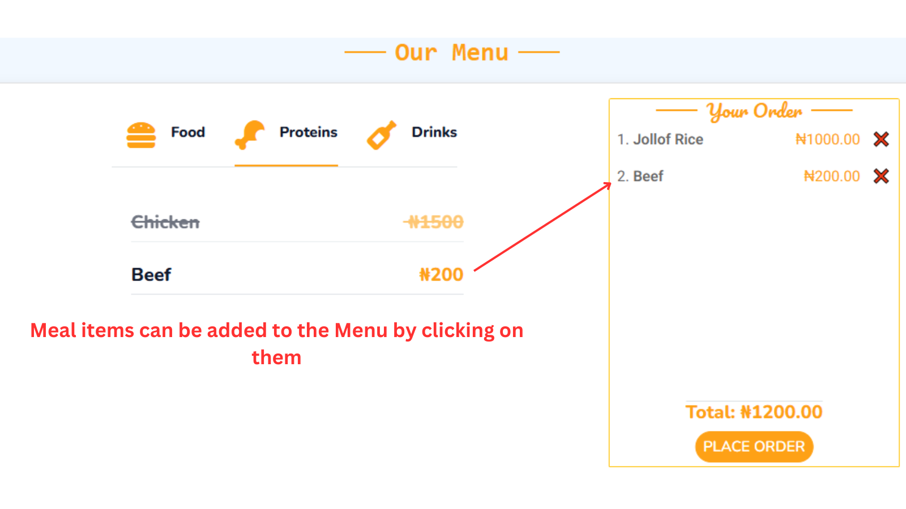
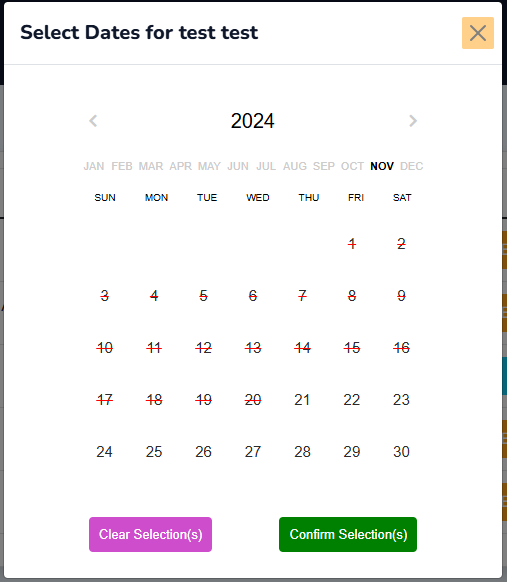
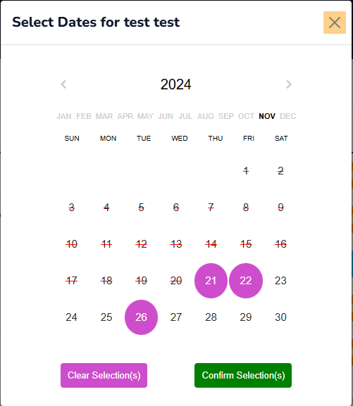

The frontend of this application is built as a Multi-Page Application (MPA), providing a traditional, server-rendered experience with multiple distinct pages and navigation flows. This approach ensures that each page is independently loaded and rendered.

## Frontend Stack

The frontend technologies used in this application are:

- HTML5
- CSS3
- Bootstrap
- JavaScript
- JQuery

## User Interface and Experience (UI/UX)

While MPAs often result in more page refreshes, we focus on providing a smooth, intuitive navigation experience with clear calls to action and content organization.
Each page is designed with accessibility and user-centric design principles to ensure that all users, regardless of device or ability, can interact with the application effectively.
The entire application is fully responsive and adjusts to different screen sizes. From the navigation menu to the responsive tables, users with
different screen sizes can access and enjoy the experience while on the application.

## Architecture

### Frontend Structure

#### Templates

By default, Django stores Html files in the templates directory. The _templates_ folder is sub-divided into folders containing Html files.

```
└── 📁templates
    └── 📁account
        └── add_user_to_group.html
        └── change_password.html
        └── login.html
        └── search_popup.html
        └── search.html
        └── staff_biodata.html
        └── update_department.html
        └── user_register.html
    └── 📁base
        └── base.html
    └── 📁include
        └── footer.html
        └── navbar.html
    └── 📁main
        └── about.html
        └── admin_page.html
        └── canteen_manager.html
        └── contact.html
        └── index.html
        └── meal_request.html
        └── pending_meal_requests.html
        └── update_user_roster.html
        └── user_request_details.html
        └── user_roster.html
```

The sub-folders in the `templates` directory are:

- **account**: Stores pages related to user accounts, authentication and authorization.
- **base**: This template serves as a foundational template from which other templates inherit. This ensures consistency across multiple pages of a web application.
  In this base file, `navbar.html`, a modal component, block content and `footer.html` were inherited.
- **include**: Houses the two major components that would be rendered across every page in the application which are the _**navbar**_ and _**footer**_.
- **main**: Includes all the other templates used in the project.

#### Static Folder

Consists of static files. Click [here](../developers/Overview.md#static) to view folder structure.

## Design Pattern

The frontend of this application is built using the Component-based pattern provided by Bootstrap. Bootstrap offers a collection of pre-designed, re-usable UI components and utilities. This ensures the application's UI stays responsive and consistent. Components such as buttons, navbars, modals, tables and forms were heavily used throughout the application. These components were customized to fit into different pages. For example, the Bootstrap Button component:

```html
<button
  type="submit"
  name="action"
  value="approve"
  class="btn btn-success btn-sm m-1"
>
  Approve
</button>
<button
  type="submit"
  name="action"
  value="decline"
  class="btn btn-danger btn-sm m-1"
>
  Decline
</button>
```

Both are buttons but differ in both their UI and functionality.

- The _Approve_ button has a `success` button class with a green background color. Functionally, it is used to approve requests.
- The _Decline_ button has a `danger` button class with a red background color. Functionally, it is used to decline requests.

Bootstrap's grid system and responsive utilities were also harnessed to enhance modular design and uniform layouts.

## Data Flow within the Frontend

As this application is a Multi-Page Application, data flow involves transferring and managing data across multiple
pages.

**Event Handling and DOM Manipulation**

Data within the application's frontend is primarily driven by user events like clicks, form submissions, or keyboard inputs. Event listeners are set up across the application to capture these interactions and update the DOM dynamically.

For example: On initial load, meal data is loaded from the backend and displayed on the frontend. The meal items would have to be selected individually to be added to a Menu.



On selection of meal items, the following DOM manipulations occurs on a click event:

- Meal items with their prices are added to the Menu (located at the far right on large screens or below on small screens).
- Adds up the total price of selected meal items.

On clicking the **Cancel** button (❌) on the individual meal items, the meal item is removed from the Menu and total price is re-calculated dynamically.

JavaScript processes events and updates relevant parts of the DOM throughout the application.

**Key characteristics of the Application's Data Flow**

- **Page Reload**: Navigating between pages involves a complete page reload,
  where the browser requests a new HTML file from the server.
- **Isolated States**: The server serves each page as a standalone HTML document, which requires the browser to reload or navigate.
  to load a new page. That means each page typically manages its own state since the frontend is reset with every reload.
- **Backend-Driven**: The Django backend plays a significant role in preparing and sending data to the frontend,
  often embedded in the HTML or sent dynamically.

## Component Breakdown

Components break down complex user interfaces into manageable, reusable pieces, making development more efficient and the code easier to maintain.

**We use Components for**:

- **Reusability**: After initial creation, we can use them anywhere.
- **Modularity**: Each component handles its own functionality, keeping the code organized.
- **Scalability**: Easier to update and expand by working on independent components.
- **Consistency**: Uniform design and behavior across the application.

### Base Template

This serves as a skeleton or layout for all other pages. Every page in the application contains a **navbar**, **footer**, and a **toast** component, which is displayed conditionally with different messages. To ensure consistency across all pages, these components are included in the _**base template**_.

### Block Content

As part of Django's template inheritance system, the application page layout uses the `` to
allow for creation of reusable templates. A block is a section or placeholder in a base template (like **base.html**)that can be overriden in child templates.
Every html page content in the application (aside the **navbar**, **footer** and **base**) would be placed within the `` and `` tags.

For example:

```js title="templates/main/contact.html"

//highlight-next-line

  <div class="container-fluid contact">
    // Rest of Code
  </div>
//highlight-next-line

```

Here is how the **Base.html** file looks like:

```html title="templates/base/base.html"
<!DOCTYPE html>
<html lang="en">
  <head>
    // head content
  </head>
  <body>
    

    <main>
      
      <div
        class="toast-container position-fixed top-0 start-50 translate-middle-x p-3 custom-toast-container "
      >
        
        <div
          id="liveToast"
          class="toast custom-toast alert-{{ message.tags }}"
          role="alert"
          aria-live="assertive"
          aria-atomic="true"
        >
          <div
            class="toast-header alert-{{ message.tags }} bg-dark text-primary"
          >
            <strong class="me-auto"> ✉ Notification</strong>
            <button
              type="button"
              class="btn-close"
              data-bs-dismiss="toast"
              aria-label="Close"
            ></button>
          </div>
          <div class="toast-body text-white fs-4 fw-medium">{{ message }}</div>
        </div>
        
      </div>
        
    </main>
    
  </body>
</html>
```

## Using JQuery

JQuery was used in the calendar functionality, specifically for admins who select call dates for clinicians registered under their department.



JQuery enabled complex manipulations on the Calendar that simplified the process of date selections.

The functionalities of the Calendar are:

- Fetching and displaying the calendar.
- Disabling past dates, making them unavailable for selection.
- On clicking any of the dates on the calendar, the selection is indicated by a purple circle (🟣) around it.



- On clicking an already selected date on the calendar, it deselects the date(s) and removes the purple indicator.

:::info
Functionally, the selection action adds call dates to the calendar while, the de-selection action removes the call dates from the Roster array.
:::

- The **Clear Selection(s)** button de-selects/removes every selected dates.
- The **Confirm Selection(s)** button saves the selected dates to the database.

## Responsive Design

By default, Bootstrap comes with capabilities of adjusting content to fit different screen sizes. However, some extra techniques were used to make contents fully laid out properly, they are:

**Flex System**

The Flex system in Bootstrap leverages the CSS Flexible Box Layout Module (Flexbox) to create flexible and responsive layouts with minimal effort. It offers key feature such as:

- **Alignment and Justification**: To align items vertically or horizontally using classes like `.align-items-center` or `.justify-content-between`.
- **Direction Control**: Easily change the direction of elements using `.flex-row` or `.flex-column`.
- **Spacing**: To adjust spacing between elements with utilities like `gap-*`.
- **Flexibility**: Used .flex-grow-_ and .flex-shrink-_ to define how elements grow or shrink in a container.

**Use Cases**:

- Building complex alignment structures for elements like buttons or icons.
- Achieving consistent spacing between elements, regardless of content size.

**Grid System**

The Grid system is the foundation of responsive layouts in Bootstrap. It provides a 12-column layout structure, allowing you to divide your page into sections that resize proportionally based on the viewport size. It has key features such as:

- **12-Column Layout**: Divide the layout into 12 parts, making it easy to control widths using classes like `.col-6` (half-width).
- **Breakpoints**: Define column behavior at different screen sizes with classes like `.col-sm-*`, `.col-md-*`, .`col-lg-*`.

**Use Cases**:

- Creating multi-column layouts for content sections.
- Building responsive forms.
- Aligning and resizing elements seamlessly for various devices (mobile-first approach).

Here is a code example from the application that combines both the flex and grid system:

```js title="templates/main/meal_request.html"
<div id="tab-1" class="tab-pane fade show p-0 active">
  //highlight-next-line
  <div class="food-div row justify-content-center">
    
    //highlight-next-line
      <div class="col-8 d-flex justify-content-center align-items-center mb-3">
      // Rest of the code
      </div>
    
  </div>
</div>
```

**Media Queries**

Media queries are a feature of CSS3 that enable developers to apply styles conditionally based on specific characteristics of the user's device or viewport, such as screen size, resolution, orientation, and more. They are a fundamental tool in Responsive Web Design, allowing the application to adapt it's layouts and styles to different devices like desktops, tablets, and smartphones.

These media queries can be found in the `style.css`:

```css title="static/css/style.css"
@media screen and (max-width: 460px) {
  .nav-div.container-xxl {
    padding-top: 3px !important;
    padding-bottom: 3px !important;
  }
}
```

The css styling takes effect when the screen size is less than 460px. Basically, this styling is targeting small screen devices (smartphones to be precise).

## Routing and Navigation

The application is divided into several pages, each representing a distinct view of the canteen system.These pages are accessible through navigation links that trigger full page reloads, providing a traditional browsing experience.
Routing is managed by the backend, where the server responds with a different HTML page based on the URL requested. This routing structure ensures that each page has its own URL, making the app more accessible and shareable.

## Performance Considerations

MPAs traditionally have longer load times due to full page reloads with each navigation. However, we mitigate this by implementing strategies such as:

- **Lazy Loading**: Non-critical JavaScript and assets are loaded only when needed to ensure that the initial load time is minimized.
- **Optimized Asset Delivery**: Styling resources such as Bootstrap, Google fonts, Font Awesome were served via a Content Delivery Network (CDN) to reduce load times for users. The application uses the Hybrid approach to Bootstrap CDNs which is a combination of the remote link and locally hosting the CDN resources (Bootstrap).
