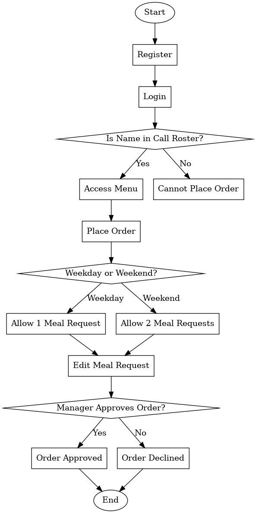

The **FMCK Canteen App** was developed to streamline the meal ordering process of clinical staffs on call duty in the center. The application performs diverse functions such as placing order, tracking meal request history, editing an active order and so on.

This application offers:

- User-friendly interface.
- Effortless meal ordering.
- Real-time notifications.
- Order history.

This section is designed to help both front-end and back-end developers understand the architecture and development process of the system.

## Technology Stack

This application was built with the following technologies, frameworks, libraries and tools:

- HTML5
- CSS3
- Bootstrap
- JavaScript
- JQuery
- Python
- Django
- SQLite

## Prerequisites

Before you proceed with installing and running the Django-based application, ensure that your system meets the following requirements.

**System Requirements**

To run this application, your system should have the following specifications:

- **Operating System**:

  - Windows 10 or later
  - macOS 11.0 or later
  - Linux (Ubuntu 20.04 LTS or equivalent)

- **Hardware**:

  - Processor: Intel Core i3 or equivalent
  - RAM: 4GB minimum (8GB recommended)
  - Disk Space: At least 2GB of free storage

- **Network**:
  - Active internet connection (for initial setup and dependencies)

**Software Requirements**

Visit [Installation](../developers/Installation.md) page for further instructions on how to set up the application locally on your machine.

By ensuring the prerequisites are met, you can avoid potential setup issues and proceed smoothly with the installation and usage of the application.

## System Architecture

The FMCK Canteen app was built using a Web and Application-Specific architecture, focusing on design patterns and organizational structures during development.

The application development process adhered to the strict structure of the Web and Application-Specific architecture for managing data flow, user interactions, backend processes, and the relationship between the client and server. This architecture further ensures that the application optimizes scalability, performance, and maintainability.

## Components Interaction

The application is a Multi-Page Application (MPA), and the components on the frontend and backend interact through traditional client-server architecture. This model typically involves server-side rendering (SSR), where each user interaction that requires a new page or updated content leads to a complete page reload.

On the Frontend (Client-Side):

- HTML, CSS, and JavaScript are rendered in the browser.
- Each user action that requires new content triggers a new HTTP request to the server.
- Pages are fully loaded or refreshed on every request.

On the Backend (Server-Side):

- Handles requests from the client and generates HTML responses dynamically.
- Serves static files such as CSS, JS, and images.
- Executes logic, interacts with the SQLite database, and delivers data/content.

## Project Directory Structure

The folder structure of the application is organized as follows:

```
└── 📁accounts
└── 📁canteen
└── 📁main
└── 📁static
└── 📁templates
```

### Accounts

This is the main directory for the `accounts` module, which handles user-related functionality such as user accounts, authentication and authorization.
It includes the following sub-folders and files:

```
└── 📁accounts
    └── 📁__pycache__
    └── 📁migrations
    └── __init__.py
    └── admin.py
    └── apps.py
    └── models.py
    └── tests.py
    └── urls.py
    └── views.py
```

- 📁**pycache**: This directory contains automatically generated bytecode files.
- 📁migrations: Contains database migration files that track changes to the database schema.
- **init**.py: Initializes the `accounts` module.
- `admin.py`: Contains the configuration for the Django admin interface for the `accounts` module.
- `apps.py`: Defines the `accounts` application configuration.
- `models.py`: Contains the data models for the `accounts` module, such as user models and related entities.
- `tests.py`: Contains test cases for the `accounts` module to ensure functionality.
- `urls.py`: Maps URL patterns to views for the `accounts` module.
- `views.py`: Contains the view functions or classes for rendering user interfaces or handling requests.

### Canteen

This is the main directory of the Django project, containing the primary settings and configuration files.
It includes the following sub-folder(s) and files:

```
└── 📁canteen
    └── 📁__pycache__
    └── __init__.py
    └── asgi.py
    └── settings.py
    └── urls.py
    └── wsgi.py
```

- `__init__.py`: Marks this directory as a Python package, ensuring that Django can recognize it as part of the project.
- `asgi.py`: Contains the ASGI configuration for the project, which is used for handling asynchronous requests in Django.
- `settings.py`: Contains the main configuration for the project, including database settings, installed apps, middleware, static files settings, etc.
- `urls.py`: Defines the URL routing for the project, mapping URLs to views.
- `wsgi.py`: Contains the WSGI configuration for the project, used for deploying the project in a production environment.

### Main

This is the core application directory, which contains all the essential files for the functionality of the main app.
It includes the following sub-folders and files:

```
└── 📁main
    └── 📁__pycache__
    └── 📁migrations
    └── 📁templates
    └── __init__.py
    └── admin.py
    └── apps.py
    └── forms.py
    └── models.py
    └── tests.py
    └── urls.py
    └── views.py
```

- `📁__pycache__`: Contains automatically generated bytecode files that Python uses to optimize performance.
- `📁migrations`: Holds database migration files that manage changes to the database schema over time.
- `📁templates`: Contains HTML template files used for rendering views.
- `__init__.py`: Marks this directory as a Python package, allowing Django to recognize it as part of the application.
- `admin.py`: Configures how the application's models are displayed and managed in the Django admin interface.
- `apps.py`: Contains the configuration for the Django app, defining metadata like its name and label.
- `forms.py`: Contains the form classes used for validating and processing user input.
- `models.py`: Defines the data models for the application, including the structure of the database tables.
- `tests.py`: Holds test cases for the application to ensure its functionality works as expected.
- `urls.py`: Defines the URL routing for the application, mapping URLs to specific views.
- `views.py`: Contains the view functions or classes that handle incoming requests and return responses such as rendering templates or redirecting users.

### Static

The Static folder consists of static files, which are directly served to the client by the server and do not change dynamically. They are important for rendering and styling the user interface of this application.
It includes the following sub-folders:

```
└── 📁static
    └── 📁css
    └── 📁img
    └── 📁js
```

- `📁css`: Contains the CSS stylesheets used to style the application's front-end.
- `📁img`: Holds image files used across the application, such as logos, icons, and other media assets.
- `📁js`: Contains JavaScript files that add interactivity and functionality to the front-end of the application.

### Templates

This is the main directory for all template files in the project. Templates in this folder define the HTML structure for rendering dynamic content.
It includes the following sub-folders:

```
└── 📁templates
    └── 📁account
    └── 📁base
    └── 📁include
    └── 📁main
```

- `📁account`: Contains templates related to user account functionality, such as login, registration, and profile pages.
- `📁base`: Holds base template files that define the general layout and structure of pages (e.g., header, footer, and navigation) that are extended by other templates.
- `📁include`: Contains reusable components or partial templates that can be included in other templates, such as navigation bars, footers, or modal dialogs.
- `📁main`: Includes templates specific to the main app, defining pages and views related to the core functionality of the application.

## Process Flowchart

This flowchart provides a visual walk-through of the application's process flow and an idea of how the system operates.


